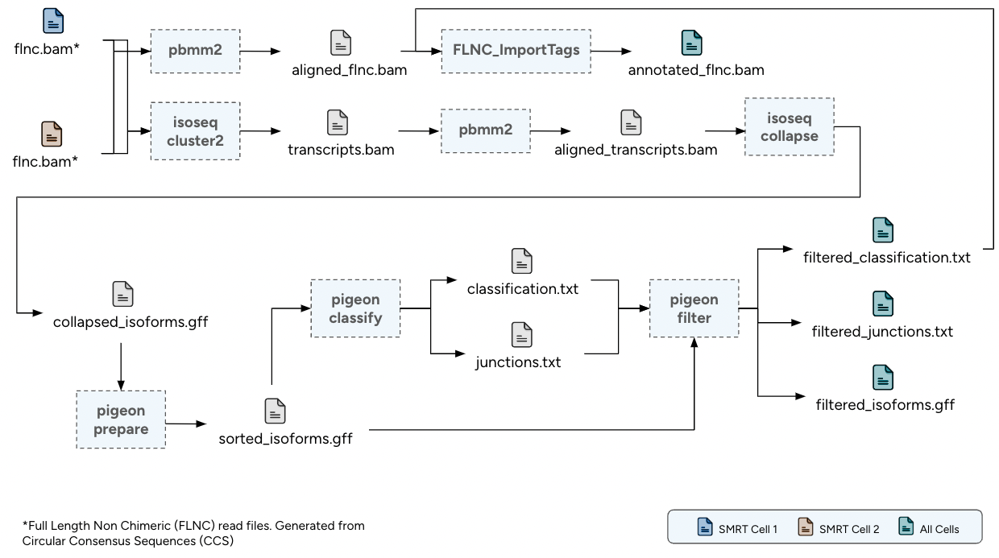

# Long-Read RNA-seq, *PacBio Kinnex*

The long-read analysis pipeline for PacBio Kinnex RNA-seq data follows Iso-Seq processing guidelines1. It is designed for per-sample execution, handling one or more Full Length Non Chimeric (FLNC) BAM files. The pipeline has been extended to align and annotate FLNC reads with isoform-level information directly within the BAM file.

## Key Pipeline Steps

1. **Read Clustering:** Generation of high-quality consensus transcript sequences through clustering of FLNC reads.
2. **Alignment with pbmm2:** Alignment of the consensus transcripts and FLNC reads to the reference genome using pbmm2.
3. **Transcript Collapsing:** Collapsing of redundant transcripts based on exon-intron structure to define a unique set of isoforms.
4. **Isoform Classification and Filtering:** Classification and filtering of isoforms to remove potential artifacts and retain high-confidence transcripts.
5. **Read Annotation:** Annotation of aligned FLNC reads with isoform-level information embedded in the BAM file.

## Pipeline Chart

<b>1</b>: PacBio Iso-Seq Analysis Guidelines. Available at: [https://isoseq.how](https://isoseq.how)

---

<!-- This section relies on the html links generated by GitHub Pages 
and will not render correctly in Markdown -->

    <a href="/pipelines-docs/"> Home </a> -
    <a> <b> Overview </b> </a> -
    <a href="1_Clustering.html"> Clustering </a> -
    <a href="2_Alignment.html"> Alignment </a> -
    <a href="3_Collapsing.html"> Collapsing </a> -
    <a href="4_Classification_and_Filtering.html"> Classification and Filtering </a> -
    <a href="5_Annotation.html"> Annotation </a>

